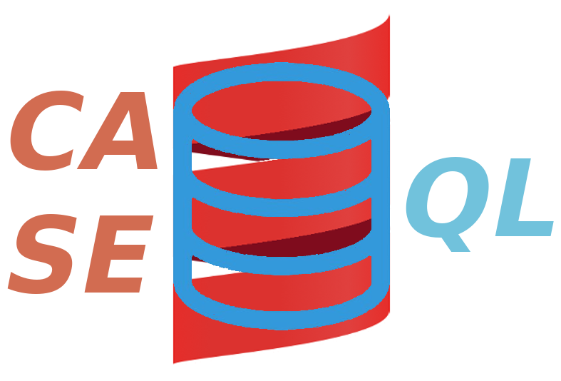

<!-- <p align="center">
    
</p> -->

# Case-QL

Case-QL is a small library for creating type-safe and JSON-serializable SQL queries using Scala case classes.
It provides basic CRUD operations for entities, and it offers a powerful filter mechanism to enable querying an
entity and its relations.

The basic idea is that case classes used to represent filters and modifications are checked at compile time
against case classes representing the data model. Basically, if your data model augmented with case-ql compiles, you  
can use this library's powerful combinators to express almost any kind of condition, taking into account also 
relations between entities.

Queries are built using implicit instances of special objects which can be derived only if the type checking succeeds.
These objects act as a glue between the serializable world and the type-safe world, i.e. if you can derive the right
implicit instance you can be sure that your serializable case class representing a filter or a modification will 
produce the desired effect when used to query or modify the entity.

For more info, read the [full documentation](./docs/intro.md).

The project is available on Sonatype release:

```scala
object caseQL {
  lazy val namespace = "com.github.reddone"
  lazy val sql = namespace %% "case-ql-sql" % caseQLVersion
  lazy val circe = namespace %% "case-ql-circe" % caseQLVersion
  lazy val gql = namespace %% "case-ql-gql" % caseQLVersion
}
```

Before installing it, give it a try! The example is a GraphQL playground with all the type checking already setup in 
the underlying Scala code. You can only see the final result, but keep in mind that all you see is the result of a 
compile time validation. To run the example using Docker, execute:

```bash
docker-compose up -d
```

This will launch the build process in a separate container, so you don't need sbt or scala installed on your machine.

To clear everything, run:

```bash
docker-compose down
docker rmi case-ql_example:latest
```

If you already have sbt on your machine, you can just run the main class in the example sub-project using:

```bash
docker-compose up -d db adminer
sbt "project case-ql-example" "runMain com.github.reddone.caseql.example.MainApp"
```

To clear everything, terminate the sbt process with Ctrl+C and run:

```bash
docker-compose down
```

## Motivation

When I first saw GraphQL and its ecosystem ([Prisma](https://www.prisma.io/docs) in particular) I was immediately 
caught up by the possibility of using filters like this:

```
Query all Post nodes that are either published and whose title is in a list of given strings, 
or have the specific id we supply:

query($published: Boolean) {
  posts(where: {
    OR: [{
      AND: [{
        title_in: ["My biggest Adventure", "My latest Hobbies"]
      }, {
        published: $published
      }]
    }, {
      id: "cixnen24p33lo0143bexvr52n"
    }]
  }) {
    id
    title
    published
  }
}
```

and I wanted to write a Scala library for doing similar things using JSON objects, with a little difference: instead
of using code generation from a supplied schema, I wanted the code to dictate the rules on what we can do on an entity.
So the entire project can be summarized with: 

**"You write the code, and the code itself will dictate you if you can do
certain operations, with the promise that everything will be serializable"**

You are responsible for writing case classes for entities, filters, modifiers and links; in exchange, you get a compile 
time checking on your case classes, and you get a runtime query generation mechanism which let you traduce a JSON like
this one into a SQL query like this:

```
Get all people having age between 15 and 65,
and who are either living in Rome or have an "a" in their name, 
and who have at least one pet which is older than three years

{
  "age": { "GT": 15, "LT": 65 },
  "OR": [
    {
      "city": { "EQ": "Rome" }
    },
    {
      "name": { "CONTAINS": "a" }
    } 
  ], 
  "pets": {
    "SOME": {
      "age": { "GTE":  3 }
    }
  }
}
```

knowing they will work 100% with target entities. And there's much more! You can also query entities using deep 
nested filters and write practically any kind of condition. You can perform insert, update and delete operations.
There are also some interesting utilities for working with Doobie, for example you can work with raw data in the form 
*Map[String, Any]*.

Considering that everything is serializable, this library is a good fit if you work with GraphQL. There is a module
dedicated to [Sangria](https://github.com/sangria-graphql/sangria) and I plan to add support in the future for 
[Caliban](https://github.com/ghostdogpr/caliban). This library uses [Doobie](https://github.com/tpolecat/doobie) 
to deal with SQL queries but since it relies only on the possibility to combine SQL strings, it is possible to add 
support for any SQL library which support interpolation and concatenation of such strings. For example, it will be 
possible to support [Scalikejdbc](https://github.com/scalikejdbc/scalikejdbc) with little modifications. I am not 
planning to add [Slick](https://github.com/slick/slick) and [Quill](https://github.com/getquill/quill) support because 
they are not based on the fragment approach: I strongly believe that we should write plain SQL and not try to port SQL 
inside Scala.

For a full explanation read the [documentation](./docs/intro.md).

## TODO

This is my first open source project, and it started as a project-based-learning approach to learn Shapeless. It helped 
to remove boilerplate in GraphQL projects, but it was far away from being a library. I worked a lot on transforming it
into a library, and I tried my best to write decent tests. Here are some features that can be added:

- [ ] add aggregations inside select queries and filters

- [ ] add joins

- [ ] provide support for caliban

- [ ] abstract over Fragment in order to include Scalikejdbc support

## Inspiration

This project was inspired by [Prisma](https://www.prisma.io/docs) and [Scarm](https://github.com/bacota-github/scarm) 
even if the approach I have chosen is totally different. I don't want to deal with DDL, indices and other SQL stuff,
my goal is to leave schema related tasks to SQL, because they are better solved using pure SQL (I only used the
concept of primary keys because byKey queries are quite common).
Special thanks to the [Doobie](https://github.com/tpolecat/doobie) project for providing an awesome JDBC library for
Scala.

## License

All code is available to you under the MIT license, available at http://opensource.org/licenses/mit-license.php 
and in the LICENSE file.
